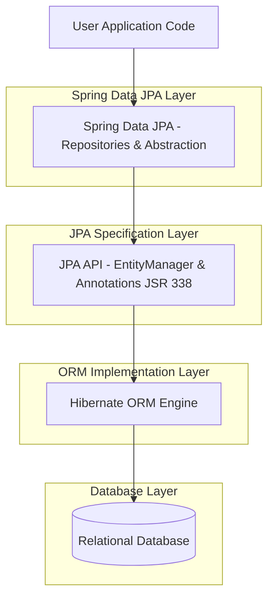

# Hands on 4: Difference between JPA, Hibernate, and Spring Data JPA

Understanding the relationship and differences between **JPA**, **Hibernate**, and **Spring Data JPA** is essential for Java enterprise development. This project demonstrates how they differ conceptually and compares the implementation footprint of traditional Hibernate with Spring Data JPA.

---

## Architectural Comparison



| Technology | Role | What is it? | Key Interfaces / Classes |
| :--- | :--- | :--- | :--- |
| **Java Persistence API (JPA)** | **Specification** | A standard Java specification (JSR 338) that defines interfaces and metadata for ORM. It has no concrete execution code. | `EntityManager`, `EntityManagerFactory`, `@Entity`, `@Table` |
| **Hibernate** | **Implementation** | A concrete ORM framework that implements the JPA specification and provides the actual SQL execution engine. | `Session`, `SessionFactory`, `Transaction` |
| **Spring Data JPA** | **Abstraction** | A framework from the Spring ecosystem that wraps JPA/Hibernate, dynamically creating implementation classes for repository interfaces to eliminate boilerplate code. | `JpaRepository`, `CrudRepository`, `@Transactional` |

---

## Code Implementations & Snippets

Below is a side-by-side comparison of the code required to perform a simple record insert operation using traditional **Hibernate** versus **Spring Data JPA**.

### 1. Traditional Hibernate Approach
Requires manual management of sessions, opening connections, managing transaction states (begin, commit, rollback), and closing the session within a `try-catch-finally` block.

```java
package com.cognizant.handson4.hibernate;

import org.hibernate.Session;
import org.hibernate.SessionFactory;
import org.hibernate.Transaction;
import org.hibernate.HibernateException;
import com.cognizant.handson4.model.Employee;

public class HibernateEmployeeDAO {

    private SessionFactory factory;

    public HibernateEmployeeDAO(SessionFactory factory) {
        this.factory = factory;
    }

    /* Method to CREATE an employee in the database */
    public Integer addEmployee(Employee employee) {
        Session session = factory.openSession();
        Transaction tx = null;
        Integer employeeID = null;

        try {
            tx = session.beginTransaction();
            employeeID = (Integer) session.save(employee); 
            tx.commit();
        } catch (HibernateException e) {
            if (tx != null) tx.rollback();
            e.printStackTrace(); 
        } finally {
            session.close(); 
        }
        return employeeID;
    }
}
```

### 2. Spring Data JPA Approach
Boilerplate is eliminated. The developer only declares a repository interface. Transactions and session boundaries are handled declaratively.

#### The Repository Interface:
```java
package com.cognizant.handson4.springdatajpa;

import org.springframework.data.jpa.repository.JpaRepository;
import com.cognizant.handson4.model.Employee;

public interface EmployeeRepository extends JpaRepository<Employee, Integer> {
}
```

#### The Service Layer:
```java
package com.cognizant.handson4.springdatajpa;

import org.springframework.beans.factory.annotation.Autowired;
import org.springframework.stereotype.Service;
import org.springframework.transaction.annotation.Transactional;
import com.cognizant.handson4.model.Employee;

@Service
public class EmployeeService {

    @Autowired
    private EmployeeRepository employeeRepository;

    @Transactional
    public void addEmployee(Employee employee) {
        employeeRepository.save(employee);
    }
}
```

---

## Key Benefits of Spring Data JPA over Plain Hibernate
1. **No Implementation Class Needed**: You declare method signatures (e.g. `findByDepartment`) and Spring Data JPA generates the SQL query and runtime implementation automatically.
2. **Automated Transaction Management**: By adding `@Transactional`, Spring manages session boundaries and commits/rollbacks under the hood.
3. **Built-in Pagination & Sorting**: Out-of-the-box support for pagination (`Pageable`) and sorting (`Sort`) without manual query writing.

---

## Execution Output

When you run the project (`mvn spring-boot:run`), it executes both persistence strategies against an in-memory H2 database. Here is the verified console output demonstrating the successful save and retrieval operations:

```text
==========================================
HANDS ON 4: RUNNING HIBERNATE VS SPRING DATA JPA DEMONSTRATION
==========================================

[Step 1] Persisting Employee using Hibernate DAO...
Hibernate: insert into employee (department,name,salary,id) values (?,?,?,default)
Hibernate DAO saved employee. Generated ID: 1
------------------------------------------

[Step 2] Persisting Employee using Spring Data JPA Service...
Hibernate: insert into employee (department,name,salary,id) values (?,?,?,default)
Spring Data JPA Service saved employee Bob (ID is auto-generated).
------------------------------------------

[Step 3] Retrieving all employees to verify persistence...
Hibernate: select e1_0.id,e1_0.department,e1_0.name,e1_0.salary from employee e1_0
Retrieved 2 employees from database:
ID: 1, Name: Alice, Department: Engineering, Salary: 85000.0
ID: 2, Name: Bob, Department: Marketing, Salary: 62000.0
==========================================
```
## SCREENSHOTS
---


---

