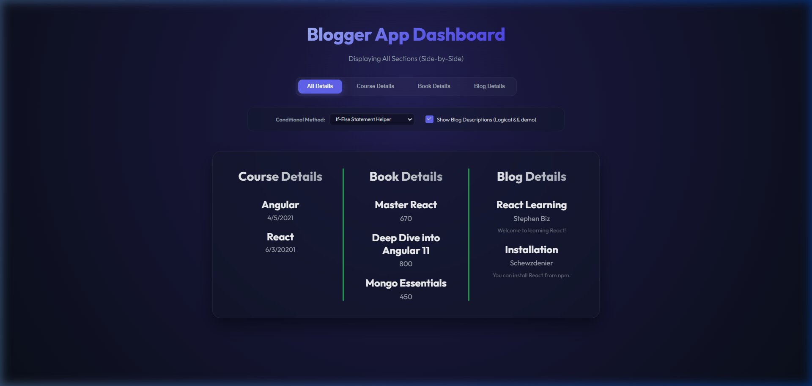
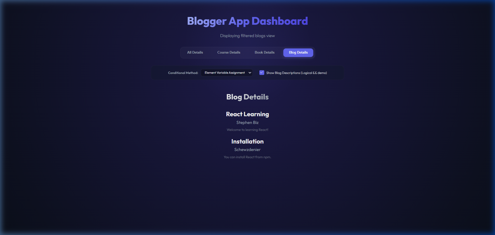

# Blogger App (bloggerapp)

A modern, responsive, and beautifully styled React application displaying Course Details, Book Details, and Blog Details side-by-side separated by green dividers. Built to demonstrate multiple conditional rendering techniques in React.

## Task Details

1. **Scaffold React Project**: Initialized in `react/react10/bloggerapp`.
2. **Components**:
   - `CourseDetails`: Maps and renders courses list (Name, Date).
   - `BookDetails`: Maps and renders books list (Name, Price) following the hint layout structure.
   - `BlogDetails`: Maps and renders blogs list (Title, Author, Description).
3. **Conditional Rendering Implementations**:
   - **Ternary Operator (`? :`)**: Used to toggle header subtitles depending on active tabs.
   - **Logical AND (`&&`)**: Used in `BlogDetails` to display/hide description logs.
   - **If-Else Statement**: Inside helper function to select layouts.
   - **Switch-Case Statement**: Inside helper function to select layouts.
   - **Element Variables**: Declaring variables and dynamically assigning component markup before rendering.

---

## Guide to Execute the Application

### 1. Install Dependencies
Navigate to the root of the project and install all required packages:
```bash
npm install
```

### 2. Start the Development Server
Run the application locally:
```bash
npm start
```
*(By default, this will launch on `http://localhost:3000`. If port 3000 is already in use, you can override it using `PORT=3009 npm start`).*

---

## Visual Proof / Result Screenshots

### 1. Initial State (Displaying All Side-by-Side)
The three columns are divided by the green vertical lines:



### 2. Filtered Blog Details View
Using Element Variable Assignment logic and description toggle checkbox:


