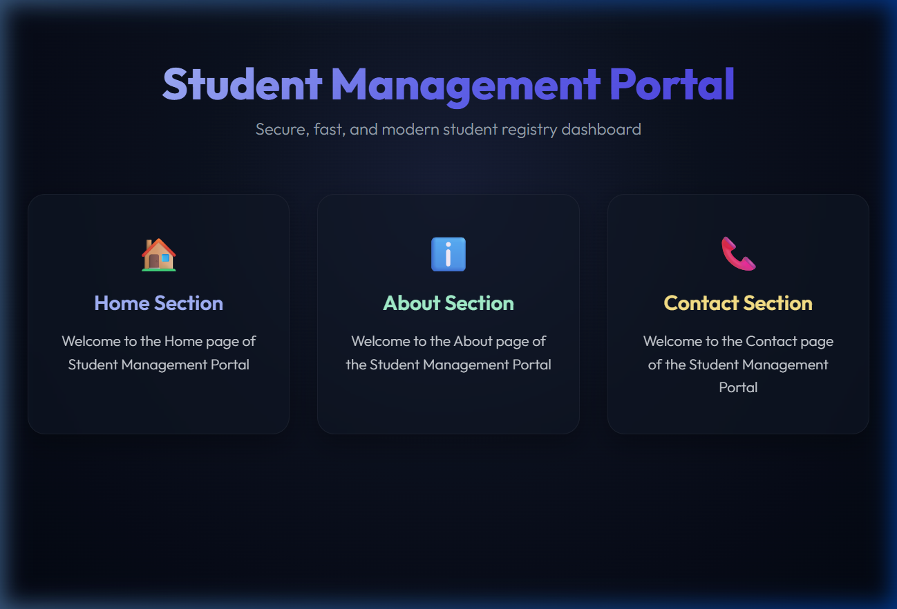

# Student Management Portal (StudentApp)

A modern, responsive, and visually stunning Student Management Portal built using React. This project demonstrates the usage of component scaffolding, component invocation, and modular design.

## Task Details

1. **Scaffold React Project**: Initialized in `react/react2/StudentApp`.
2. **Scaffold Components**:
   - `Home` component displays: *"Welcome to the Home page of Student Management Portal"*
   - `About` component displays: *"Welcome to the About page of the Student Management Portal"*
   - `Contact` component displays: *"Welcome to the Contact page of the Student Management Portal"*
3. **Assembly**: All three components are imported and invoked inside `App.js` using a premium glassmorphic dashboard grid.

---

## Component Architecture

- **Home**: Located at `src/Components/Home.js`
- **About**: Located at `src/About.js`
- **Contact**: Located at `src/Contact.js`
- **App**: Located at `src/App.js` (Invokes all three components)

---

## Guide to Execute the Application

### 1. Install Dependencies
Navigate to the root of the project and install all required packages:
```bash
npm install
```

### 2. Start the Development Server
Run the application locally:
```bash
npm start
```
*(By default, this will launch on `http://localhost:3000`. If port 3000 is already in use, it will prompt to start on another port or you can override it using `PORT=3001 npm start`).*

---

## Visual Proof / Result Screenshot

Below is the screenshot of the running application displaying the completed exercise:


