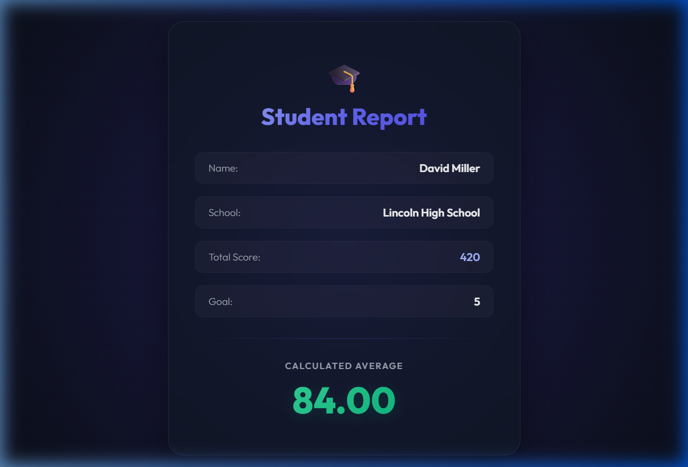

# Student Score Calculator (scorecalculatorapp)

A modern, responsive, and visually stunning Student Score Calculator built using React. This project demonstrates the usage of component props, functional component calculations, and custom stylesheet integration.

## Task Details

1. **Scaffold React Project**: Initialized in `react/react3/scorecalculatorapp`.
2. **CalculateScore Component**:
   - Accepts props: `Name`, `School`, `Total`, and `goal`.
   - Computes the average score via: `Total / goal`.
   - Renders the details inside a styled card.
3. **Custom Stylesheet**: Styled using `src/Stylesheets/mystyle.css` with radial gradients, Outfit typography, and a card format.

---

## Component Architecture

- **CalculateScore**: Located at `src/Components/CalculateScore.js`
- **Stylesheet**: Located at `src/Stylesheets/mystyle.css`
- **App**: Located at `src/App.js` (Invokes the component with props)

---

## Guide to Execute the Application

### 1. Install Dependencies
Navigate to the root of the project and install all required packages:
```bash
npm install
```

### 2. Start the Development Server
Run the application locally:
```bash
npm start
```
*(By default, this will launch on `http://localhost:3000`. If port 3000 is already in use, you can override it using `PORT=3002 npm start`).*

---

## Visual Proof / Result Screenshot

Below is the screenshot of the running application displaying the completed score calculator card:


