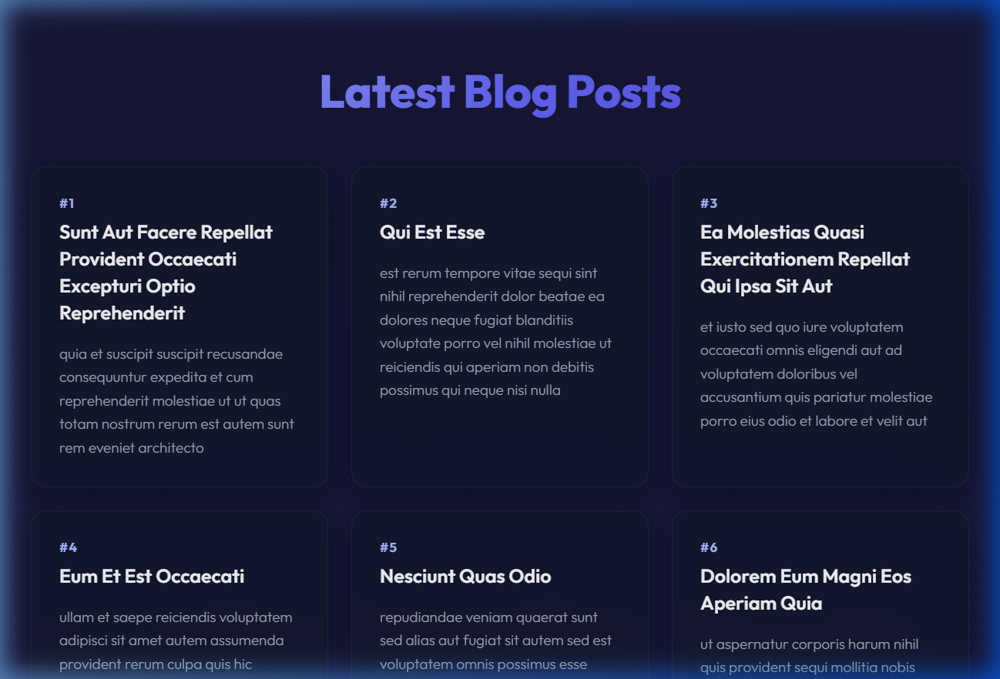

# React Blog Application (blogapp)

A modern, responsive React Blog Application built using class-based components, lifecycle hooks, and Fetch API integrations.

## Task Details

1. **Scaffold React Project**: Initialized in `react/react4/blogapp`.
2. **Post Model**:
   - Class-based model defined in `src/Post.js` containing properties `id`, `title`, and `body`.
3. **Posts Class Component**:
   - Class-based component defined in `src/Posts.js`.
   - Initializes a list of `Post` items in its component state via constructor.
   - Declares `loadPosts()` to fetch data from `https://jsonplaceholder.typicode.com/posts` using the Fetch API, instantiating `Post` objects and assigning them to state.
   - Uses the `componentDidMount()` lifecycle hook to trigger the fetch call.
   - Implements `componentDidCatch(error)` to display error alerts if any occur.
   - Renders a clean grid layout presenting the title and body of all posts.

---

## Component Architecture

- **Post Model**: Located at `src/Post.js`
- **Posts Component**: Located at `src/Posts.js`
- **App**: Located at `src/App.js` (Invokes the component)
- **App Styles**: Custom styled in `src/App.css` (Glassmorphism, dark gradient, Outfit typography)

---

## Guide to Execute the Application

### 1. Install Dependencies
Navigate to the root of the project and install all required packages:
```bash
npm install
```

### 2. Start the Development Server
Run the application locally:
```bash
npm start
```
*(By default, this will launch on `http://localhost:3000`. If port 3000 is already in use, you can override it using `PORT=3003 npm start`).*

---

## Visual Proof / Result Screenshot

Below is the screenshot of the running application displaying the completed blog app cards grid:


