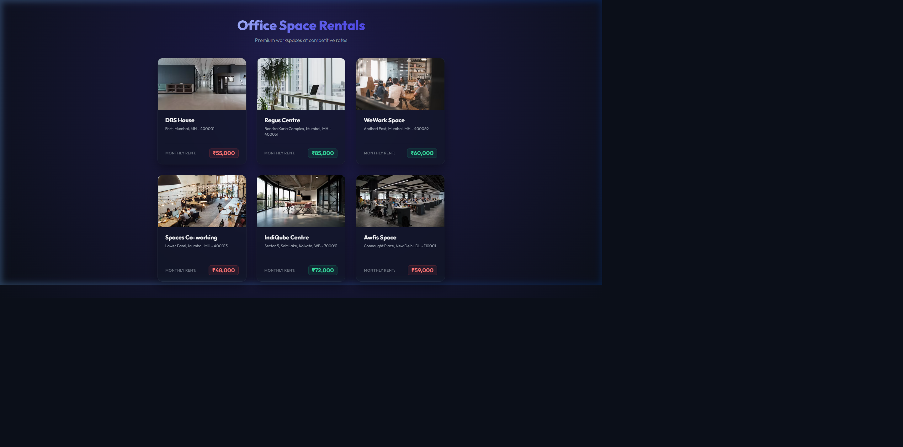

# Office Space Rental Application (officespacerentalapp)

A modern, responsive, and visually stunning React application showcasing office spaces for rent. Built using React JSX elements, attributes, mapping loops, and conditional styling.

## Task Details

1. **Scaffold React Project**: Initialized in `react/react7/officespacerentalapp`.
2. **Page Heading**: Uses a JSX heading element to display "Office Space Rentals" and a subheading.
3. **Office Object details**: Renders details (Name, Rent, and Address) from an array of office space objects.
4. **Dynamic Image Attributes**: Renders the image of each office space using dynamic JSX `src` and `alt` attributes.
5. **Conditional Rent CSS**:
   - Rent amount below ₹60,000 displays in **Red** (class `.rent-red`).
   - Rent amount above/equal to ₹60,000 displays in **Green** (class `.rent-green`).

---

## Guide to Execute the Application

### 1. Install Dependencies
Navigate to the root of the project and install all required packages:
```bash
npm install
```

### 2. Start the Development Server
Run the application locally:
```bash
npm start
```
*(By default, this will launch on `http://localhost:3000`. If port 3000 is already in use, you can override it using `PORT=3006 npm start`).*

---

## Visual Proof / Result Screenshot

Below is the screenshot of the running application displaying the office spaces with conditional rent styling matching the expected layout:


