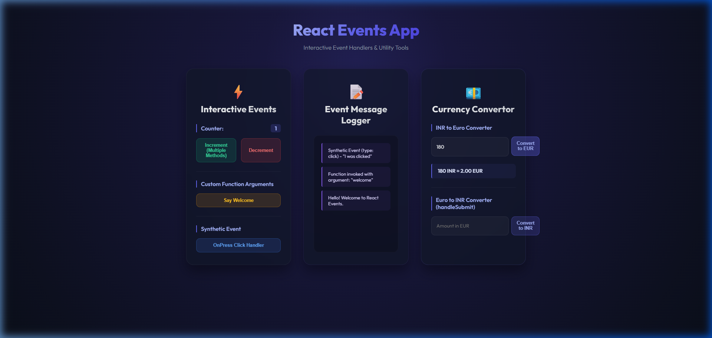

# Event Examples Application (eventexamplesapp)

An interactive, responsive, and visually stunning React application showcasing event handlers, synthetic events, multi-method triggers, argument passing, and forms.

## Task Details

1. **Scaffold React Project**: Initialized in `react/react8/eventexamplesapp`.
2. **Increment & Decrement Handlers**:
   - Includes counter state rendered on the screen.
   - Click event on the **Increment** button invokes multiple methods:
     a. Updates the counter value by incrementing it.
     b. Fires a greeting log stating "Hello! Welcome to React Events.".
   - Click event on the **Decrement** button decreases the counter.
3. **Custom Function Arguments ("Say Welcome")**:
   - Invokes a method passing a string argument (`"welcome"`), showing argument values in the log.
4. **Synthetic Events ("OnPress")**:
   - The synthetic onPress click event handler logs `"I was clicked"` along with event metadata.
5. **CurrencyConvertor Component**:
   - Converts Indian Rupees (INR) to Euros (EUR) and Euros to INR.
   - Leverages `onSubmit` handlers to capture conversions using `handleSubmit` events.

---

## Guide to Execute the Application

### 1. Install Dependencies
Navigate to the root of the project and install all required packages:
```bash
npm install
```

### 2. Start the Development Server
Run the application locally:
```bash
npm start
```
*(By default, this will launch on `http://localhost:3000`. If port 3000 is already in use, you can override it using `PORT=3007 npm start`).*

---

## Visual Proof / Result Screenshot

Below is the screenshot of the running application showing all clicked events logged and currency conversion results:


