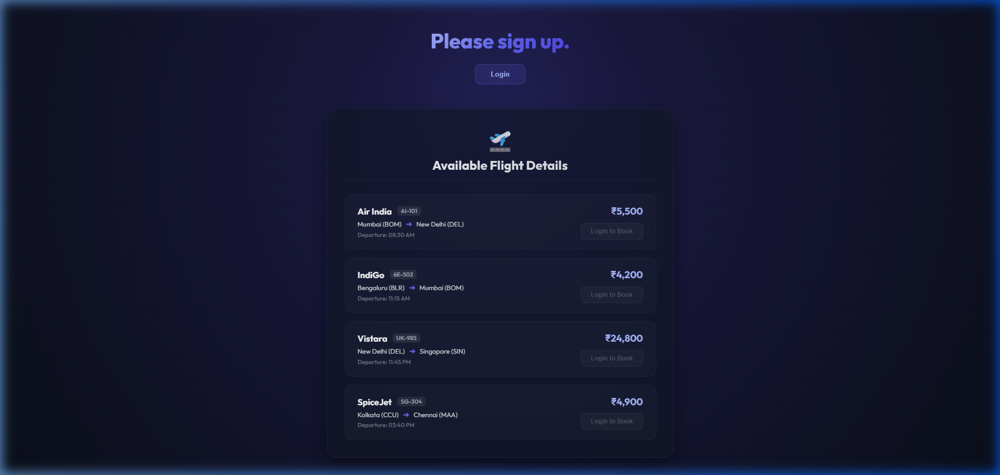
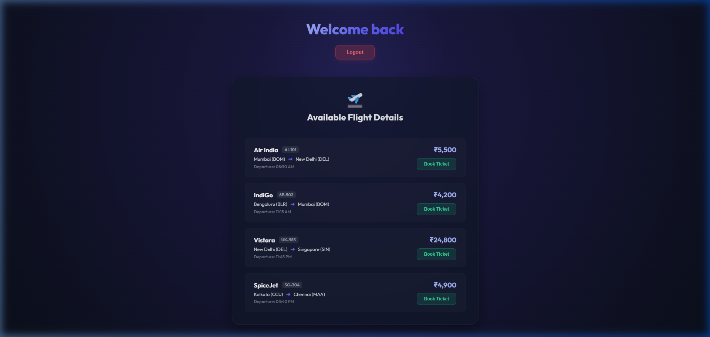
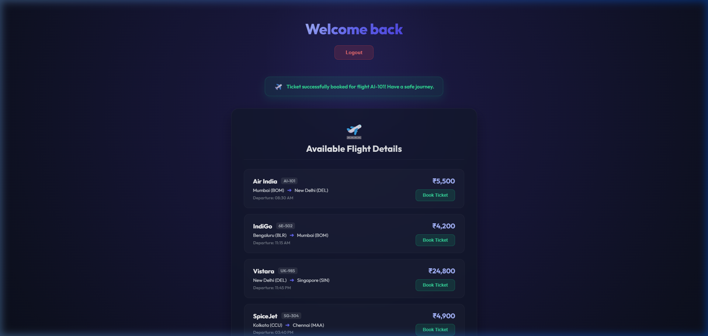

# Ticket Booking Application (ticketbookingapp)

A modern, responsive, and visually stunning React application for searching and booking flight tickets. Built with conditional page headings, LoginButton and LogoutButton functional components, and authentication-based booking permissions.

## Task Details

1. **Scaffold React Project**: Initialized in `react/react9/ticketbookingapp`.
2. **Conditional Headings**:
   - Displays **"Please sign up."** for Guest (Logged-out) users.
   - Displays **"Welcome back"** for Authenticated (Logged-in) users.
3. **Authentication Components**:
   - `LoginButton`: Invokes the login callback on click.
   - `LogoutButton`: Invokes the logout callback on click.
4. **Flight Details Grid**:
   - Displays all flight parameters (Carrier, Route, Departure Time, Price).
5. **Permissive Booking Buttons**:
   - For Guests: The "Book Ticket" buttons are disabled and styled with a `"Login to Book"` warning.
   - For Logged-in Users: The buttons are active. Clicking a button books the ticket and fires a success message toast.

---

## Guide to Execute the Application

### 1. Install Dependencies
Navigate to the root of the project and install all required packages:
```bash
npm install
```

### 2. Start the Development Server
Run the application locally:
```bash
npm start
```
*(By default, this will launch on `http://localhost:3000`. If port 3000 is already in use, you can override it using `PORT=3008 npm start`).*

---

## Visual Proof / Result Screenshots

### 1. Guest View (Flag/isLoggedIn = False)
Header displays "Please sign up." and booking button is disabled:



### 2. Logged-in View (Flag/isLoggedIn = True)
Header displays "Welcome back" and booking action is active:



### 3. Booking Successful
After clicking "Book Ticket" on an active flight:


